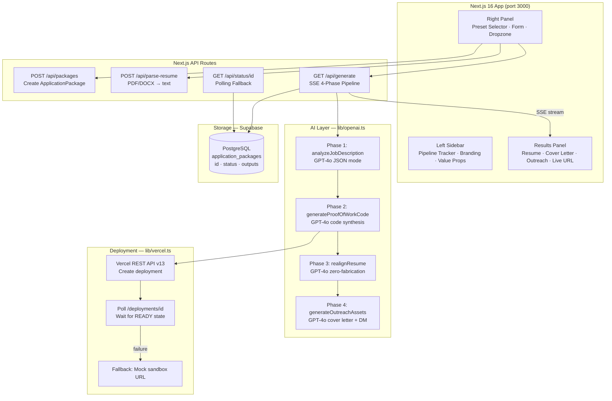
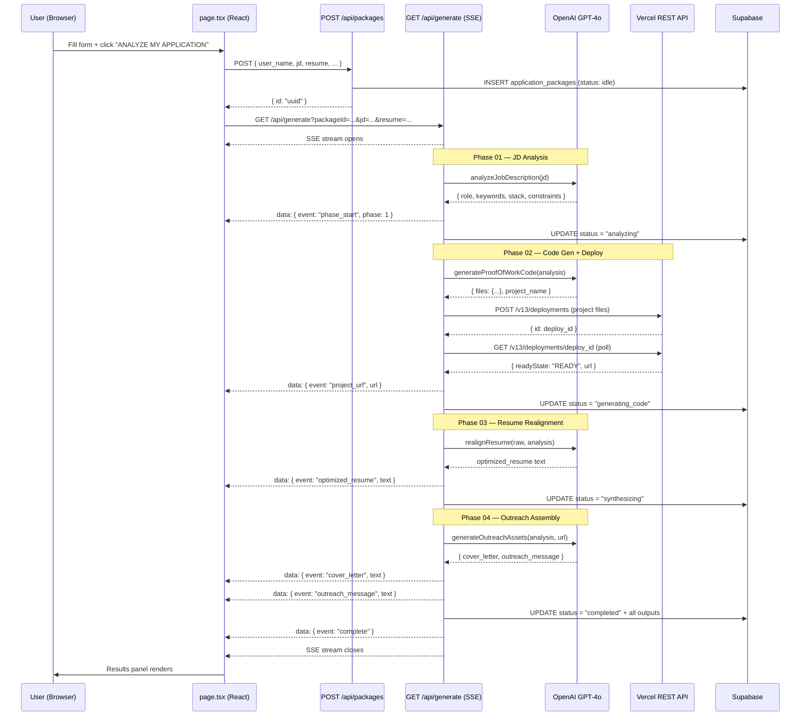
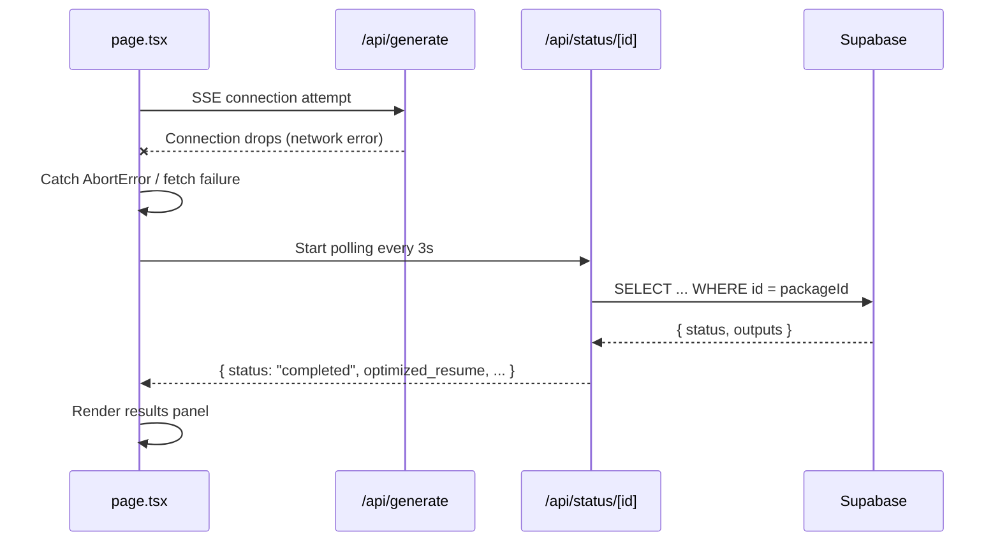

# EasyJob — Architecture Design

> AI-driven career acceleration engine using GPT-4o, Vercel REST API, and SSE streaming.

---

## System Overview



---

## Data Flow

### SSE Generation Pipeline



### SSE Fallback: Polling Mode



---

## Component Architecture

| Component | File | Responsibility |
|-----------|------|----------------|
| **Main Dashboard** | `app/page.tsx` | Form state, SSE orchestration, polling fallback, log stream |
| **Pipeline Tracker** | `components/PipelineTracker.tsx` | 4-step vertical tracker with idle/active/done/error states |
| **Preset Selector** | `components/PresetSelector.tsx` | One-click template hydration for 3 demo configurations |
| **Resume Dropzone** | `components/ResumeDropzone.tsx` | PDF/DOCX drag-and-drop → /api/parse-resume → text |
| **Generation Results** | `components/GenerationResults.tsx` | Tabbed panel: resume, cover letter, outreach, project URL |

---

## Library Modules

| Module | File | Key Functions |
|--------|------|---------------|
| **OpenAI** | `lib/openai.ts` | `analyzeJobDescription`, `generateProofOfWorkCode`, `realignResume`, `generateOutreachAssets` |
| **Vercel** | `lib/vercel.ts` | `deployProject`, `pollDeployment`, mock URL fallback |
| **Supabase** | `lib/supabase.ts` | Lazy `getSupabaseAdmin()`, `isSupabaseConfigured()` |
| **Document Parser** | `lib/document-parser.ts` | `parsePDF` (pdfjs-dist), `parseDOCX` (mammoth) |
| **Presets** | `lib/presets.ts` | 3 `Preset` objects with pre-filled JDs + resumes |

---

## API Routes

### `POST /api/packages`

Creates an `application_packages` row in Supabase. Returns a UUID. Falls back to local UUID if Supabase is not configured.

**Request:**
```json
{
  "user_name": "Alex Rivera",
  "target_company": "ChainForge Labs",
  "recruiter_name": "Sarah Mitchell",
  "raw_resume_text": "...",
  "job_description": "..."
}
```

**Response:** `{ "id": "uuid-v4" }`

---

### `POST /api/parse-resume`

Accepts multipart form data with a `file` field (PDF or DOCX). Extracts clean text.

**Response:**
```json
{
  "text": "Full name\nemail@...\n\nEDUCATION...",
  "wordCount": 312,
  "pageCount": 2,
  "filename": "resume.pdf"
}
```

---

### `GET /api/generate`

Core SSE endpoint. Streams JSON-encoded events across all 4 pipeline phases.

**Query Parameters:**
- `packageId` — Supabase record ID
- `userName` — Applicant full name
- `jd` — URL-encoded job description
- `resume` — URL-encoded raw resume text
- `company` — URL-encoded target company name
- `recruiter` — URL-encoded recruiter name

**SSE Events:**

| Event | Data Fields | Description |
|-------|------------|-------------|
| `phase_start` | `phase`, `label` | Pipeline phase begins |
| `phase_progress` | `data: { role, keywords, stack }` | Analysis results |
| `phase_complete` | `phase` | Phase finished |
| `log` | `level`, `message` | Real-time log entry |
| `project_url` | `url`, `isFallback` | Deployed project URL |
| `optimized_resume` | `text` | Realigned resume text |
| `cover_letter` | `text` | Generated cover letter |
| `outreach_message` | `text` | LinkedIn DM / cold email |
| `complete` | `packageId`, `summary` | All phases complete |
| `error` | `message` | Fatal pipeline error |

---

### `GET /api/status/[id]`

Polling fallback. Returns current package status + available output fields.

---

## Data Model

### `application_packages` Table

| Column | Type | Description |
|--------|------|-------------|
| `id` | UUID | Primary key |
| `user_name` | TEXT | Full name of applicant |
| `target_company` | TEXT | Optional company name |
| `recruiter_name` | TEXT | Optional recruiter name |
| `raw_resume_text` | TEXT | Extracted resume text |
| `job_description` | TEXT | Full JD text |
| `project_demo_url` | TEXT | Vercel URL (or sandbox fallback) |
| `optimized_resume` | TEXT | ATS-realigned resume |
| `cover_letter` | TEXT | Markdown cover letter |
| `outreach_message` | TEXT | LinkedIn DM template |
| `status` | TEXT | Pipeline state enum |
| `created_at` | TIMESTAMPTZ | Creation timestamp |

**Status enum:** `idle → analyzing → generating_code → deploying → synthesizing → completed | failed`

---

## Technology Stack

| Layer | Technology | Version | Reason |
|-------|-----------|---------|--------|
| Framework | Next.js | 16.x (App Router) | Full-stack SSE support, edge runtime |
| Language | TypeScript | 5.x | Type safety across full stack |
| Styling | Tailwind CSS + Custom CSS | 3.x | Cream editorial palette, fine control |
| State | React 19 hooks | — | useState + useRef for SSE orchestration |
| Database | Supabase (PostgreSQL) | latest | Managed Postgres, simple client |
| LLM | OpenAI GPT-4o | — | Best-in-class NLP + code generation |
| PDF Parsing | pdfjs-dist | 5.x | Server-side, no canvas dependency |
| DOCX Parsing | mammoth | 1.x | Clean text extraction from .docx |
| Deployment API | Vercel REST API | v13 | Headless deployment of generated projects |
| Streaming | Server-Sent Events | Web standard | Unidirectional, HTTP-native, no WS overhead |
| IDs | uuid v4 | 10.x | Fallback package IDs without Supabase |

---

## Design Principles

### Zero-Fabrication Guardrail

The resume realignment system prompt explicitly prohibits inventing facts:

```
CRITICAL ZERO-FABRICATION GUARDRAIL:
- You MUST NOT invent job titles, companies, dates, or metrics
- You MUST NOT fabricate experience, skills, or achievements
- You MAY rephrase existing experience using the JD's exact vocabulary
- You MAY reorder sections to lead with the most relevant experience
```

This prevents hallucinated work history while still achieving maximum ATS alignment.

### Graceful Degradation

Every external service has a fallback:
- **Vercel failure** → Mock sandbox URL, pipeline continues
- **SSE connection drop** → Client-side polling every 3 seconds
- **Supabase unconfigured** → Local UUID, no persistence
- **OpenAI error in any phase** → Fallback content, subsequent phases continue

### Lazy Client Initialization

All API clients (OpenAI, Supabase) are instantiated on first use — not at module evaluation time — allowing production builds to succeed without environment variables set.

---

## Deployment

### Local Development

```bash
git clone https://github.com/your-org/easyjob.git
cd easyjob
npm install
cp .env.example .env.local
# Fill in API keys
npm run dev
# → http://localhost:3000
```

### Vercel Production

```bash
# Install Vercel CLI
npm i -g vercel

# Deploy
vercel --prod

# Set environment variables via Vercel dashboard or CLI:
vercel env add OPENAI_API_KEY
vercel env add NEXT_PUBLIC_SUPABASE_URL
vercel env add SUPABASE_SERVICE_ROLE_KEY
vercel env add VERCEL_API_TOKEN
```

### Environment Variables

| Variable | Required | Description |
|----------|----------|-------------|
| `OPENAI_API_KEY` | ✅ Yes | GPT-4o API access |
| `NEXT_PUBLIC_SUPABASE_URL` | ☑ Optional | Supabase project URL |
| `NEXT_PUBLIC_SUPABASE_ANON_KEY` | ☑ Optional | Supabase anon key |
| `SUPABASE_SERVICE_ROLE_KEY` | ☑ Optional | Supabase service role |
| `VERCEL_API_TOKEN` | ☑ Optional | Live project deployment |
| `VERCEL_TEAM_ID` | ☑ Optional | Team accounts only |
| `NEXT_PUBLIC_APP_URL` | ☑ Optional | App base URL |

---

## Directory Structure

```
easyjob/
├── app/
│   ├── page.tsx              ★ Main dashboard + SSE client
│   ├── layout.tsx            Root layout + SEO
│   ├── globals.css           Design system (cream palette)
│   └── api/
│       ├── packages/         POST — create record
│       ├── parse-resume/     POST — file parser
│       ├── generate/         GET — SSE pipeline ★
│       └── status/[id]/      GET — polling fallback
│
├── components/
│   ├── PipelineTracker.tsx   ★ 4-step progress tracker
│   ├── PresetSelector.tsx    Quick template buttons
│   ├── ResumeDropzone.tsx    Drag-and-drop uploader
│   └── GenerationResults.tsx Tabbed output panel
│
├── lib/
│   ├── openai.ts             ★ GPT-4o integration
│   ├── vercel.ts             ★ Vercel deploy + poll
│   ├── supabase.ts           DB client (lazy init)
│   ├── document-parser.ts    PDF/DOCX → text
│   └── presets.ts            Demo configurations
│
├── supabase/
│   └── migrations/001_initial_schema.sql
│
├── docs/                     Extended documentation
├── .env.example
├── next.config.ts
├── tailwind.config.ts
└── package.json
```
