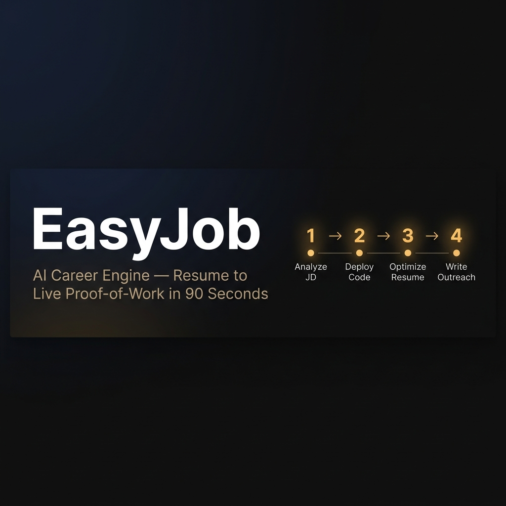
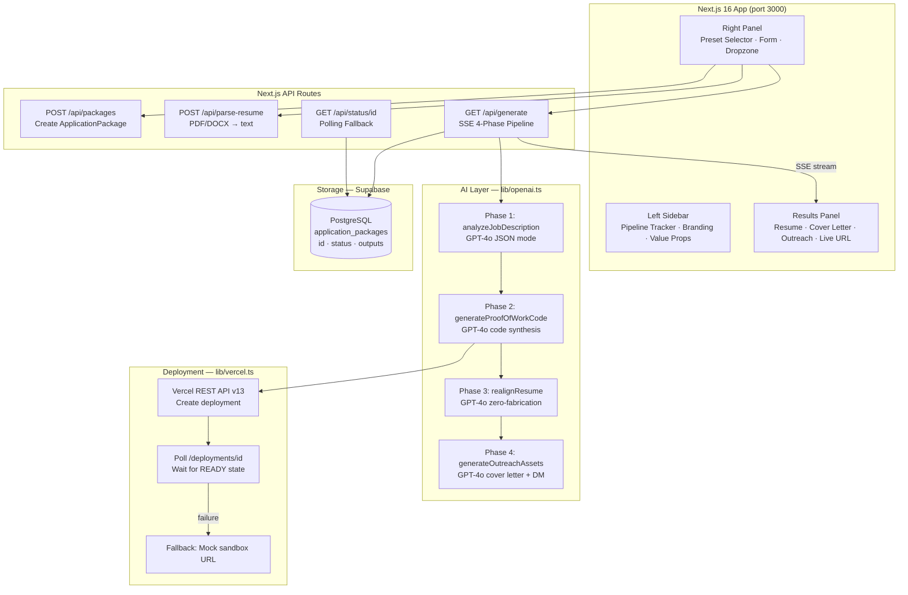

<div align="center">

[](https://github.com/Sam-max1/easyjob)
[](LICENSE)
[](https://nextjs.org/)
[](https://openai.com/)
[](https://www.typescriptlang.org/)



# EasyJob

### *From resume to live proof-of-work in under 90 seconds.*

**EasyJob** is an AI-powered career acceleration engine that analyzes your resume and a job description, then automatically generates a complete, ready-to-submit application package — including an ATS-optimized resume, a deployable proof-of-work project (live on Vercel), a tailored cover letter, and a high-conversion LinkedIn outreach message.

[**Try the Demo**](#quick-start) · [**View Architecture**](EASYJOB_ARCHITECTURE_DESIGN.md) · [**Report a Bug**](https://github.com/Sam-max1/easyjob/issues)

</div>

---

## ✨ What It Does

Most job applications look identical. EasyJob makes yours stand out by generating a **live, deployed coding project** built specifically for the role you're applying to — and then wrapping it in perfectly-aligned outreach materials.

**Input:** Your resume (PDF/DOCX/text) + job description paste

**Output in ~90 seconds:**
- ✅ ATS keyword-optimized resume (zero fabrication)
- ✅ Live Vercel-deployed proof-of-work project
- ✅ Tailored cover letter referencing your live project
- ✅ LinkedIn DM / cold email outreach script

---

## 🚀 Feature List

### Core AI Pipeline

| Feature | Description |
|---------|-------------|
| **JD Analysis** | GPT-4o extracts ATS keywords, tech stack, experience level, core constraints, and key responsibilities in JSON mode |
| **Proof-of-Work Code Generation** | GPT-4o synthesizes a minimal but real Next.js project demonstrating mastery of the target tech stack |
| **Live Deployment** | Generated code is deployed to Vercel via REST API v13 with real-time polling for `READY` state |
| **Deployment Fallback** | If Vercel deployment fails, a sandbox URL is returned and the pipeline continues uninterrupted |
| **Resume Semantic Realignment** | GPT-4o rephrases existing resume experience using the JD's exact vocabulary — zero-fabrication guardrail enforced |
| **Cover Letter Generation** | GPT-4o writes a 3-paragraph cover letter referencing the live project URL as primary differentiator |
| **LinkedIn Outreach Script** | GPT-4o produces a punchy 4–6 sentence DM or cold email optimized for response rate |

### Zero-Fabrication Guardrail

The resume realignment system prompt enforces strict rules:
- ❌ MUST NOT invent job titles, companies, dates, or metrics
- ❌ MUST NOT fabricate experience, skills, or achievements
- ✅ MAY rephrase existing experience using JD's exact vocabulary
- ✅ MAY reorder sections to lead with most relevant experience
- ✅ MAY expand abbreviations and add context to existing terms

### Streaming & Real-Time UX

| Feature | Description |
|---------|-------------|
| **SSE Streaming** | Server-Sent Events deliver real-time pipeline progress — no page refresh needed |
| **Live Log Stream** | Color-coded log entries (info/success/warning/error/step) scroll in real-time |
| **Polling Fallback** | If SSE drops, client automatically switches to 3-second polling via `/api/status/{id}` |
| **Elapsed Timer** | Animated timer in the sidebar tracks total generation time |
| **Phase Tracker** | 4-step visual pipeline tracker shows idle/active/done/error states per phase |

### Document Parsing

| Feature | Description |
|---------|-------------|
| **PDF Parsing** | Server-side PDF text extraction using `pdfjs-dist` (no canvas dependency) |
| **DOCX Parsing** | Clean text extraction from Word documents using `mammoth` |
| **Drag & Drop** | Dropzone UI with file validation and inline text preview |
| **Text Paste** | Direct paste of resume text if no file upload needed |

### Demo Presets

Three built-in one-click demo configurations for instant evaluation:
1. **Bootcamp Grad — Smart Contract** (Solidity, DeFi, Hardhat, OpenZeppelin)
2. **Junior Dev — Node.js Backend** (TypeScript, PostgreSQL, Redis, Docker)
3. **CC Grad — Python Data Engineer** (PySpark, Airflow, Snowflake, dbt)

### Storage & Persistence

| Feature | Description |
|---------|-------------|
| **Supabase Integration** | Application packages stored in PostgreSQL with full status lifecycle |
| **Graceful Degradation** | Works fully without Supabase — uses local UUID, no data loss |
| **Status Tracking** | Package states: `idle → analyzing → generating_code → deploying → synthesizing → completed \| failed` |

---

## 🏗️ Architecture



---

## 🛠️ Tech Stack

| Layer | Technology | Notes |
|-------|-----------|-------|
| Framework | Next.js 16 (App Router) | Full-stack SSE support, edge runtime |
| Language | TypeScript 5.x | End-to-end type safety |
| Styling | Tailwind CSS + Custom CSS | Cream editorial palette |
| State | React 19 hooks | `useState` + `useRef` for SSE orchestration |
| AI | OpenAI GPT-4o | JD analysis, code gen, resume realign, outreach |
| PDF Parsing | pdfjs-dist 5.x | Server-side, no canvas dependency |
| DOCX Parsing | mammoth 1.x | Clean text extraction from `.docx` |
| Deployment API | Vercel REST API v13 | Headless deployment of generated projects |
| Streaming | Server-Sent Events | Unidirectional, HTTP-native |
| Database | Supabase (PostgreSQL) | Optional — graceful degradation without it |
| IDs | uuid v4 | Fallback package IDs without Supabase |

---

## ⚡ Quick Start

### Prerequisites

- Node.js 18+
- OpenAI API key (GPT-4o access)
- Vercel API token (optional — for live deployments)
- Supabase project (optional — for persistence)

### Installation

```bash
# 1. Clone the repository
git clone https://github.com/Sam-max1/easyjob.git
cd easyjob

# 2. Install dependencies
npm install

# 3. Configure environment
cp .env.example .env.local
# Edit .env.local with your API keys

# 4. Start development server
npm run dev
# → http://localhost:3000
```

### Environment Variables

| Variable | Required | Description |
|----------|----------|-------------|
| `OPENAI_API_KEY` | ✅ Yes | GPT-4o API access |
| `VERCEL_API_TOKEN` | ☑ Optional | Live project deployment to Vercel |
| `VERCEL_TEAM_ID` | ☑ Optional | For Vercel team accounts |
| `NEXT_PUBLIC_SUPABASE_URL` | ☑ Optional | Supabase project URL |
| `NEXT_PUBLIC_SUPABASE_ANON_KEY` | ☑ Optional | Supabase anon key |
| `SUPABASE_SERVICE_ROLE_KEY` | ☑ Optional | Supabase service role |
| `NEXT_PUBLIC_APP_URL` | ☑ Optional | App base URL |

> **Note:** EasyJob runs fully without Supabase or Vercel configured — it falls back gracefully. Only `OPENAI_API_KEY` is strictly required.

---

## 📁 Project Structure

```
easyjob/
├── app/
│   ├── page.tsx              ★ Main dashboard + SSE orchestration
│   ├── layout.tsx            Root layout + SEO metadata
│   ├── globals.css           Design system (cream palette)
│   └── api/
│       ├── packages/         POST — create DB record
│       ├── parse-resume/     POST — PDF/DOCX file parser
│       ├── generate/         GET  — SSE 4-phase pipeline ★
│       └── status/[id]/      GET  — polling fallback
│
├── components/
│   ├── PipelineTracker.tsx   4-step progress tracker
│   ├── PresetSelector.tsx    One-click demo templates
│   ├── ResumeDropzone.tsx    Drag-and-drop uploader
│   └── GenerationResults.tsx Tabbed output panel
│
├── lib/
│   ├── openai.ts             ★ GPT-4o integration (4 phases)
│   ├── vercel.ts             ★ Vercel deploy + poll + fallback
│   ├── supabase.ts           DB client (lazy init)
│   ├── document-parser.ts    PDF/DOCX → text
│   └── presets.ts            3 demo configurations
│
├── supabase/
│   └── migrations/001_initial_schema.sql
│
├── .env.example
└── package.json
```

---

## 🔄 Pipeline Phases

| Phase | Name | What Happens |
|-------|------|-------------|
| `01` | **JD Analysis** | GPT-4o extracts ATS keywords, tech stack, experience level in JSON mode |
| `02` | **Code Generation + Deploy** | GPT-4o synthesizes a Next.js proof-of-work project; Vercel REST API deploys it live |
| `03` | **Resume Realignment** | GPT-4o semantically realigns resume to JD vocabulary (zero fabrication) |
| `04` | **Outreach Assembly** | GPT-4o writes cover letter + LinkedIn DM referencing the live project URL |

---

## 🤝 Contributing

Contributions are welcome! Please read [CONTRIBUTING.md](CONTRIBUTING.md) and [CODE_OF_CONDUCT.md](CODE_OF_CONDUCT.md) before opening a pull request.

1. Fork the repository
2. Create your feature branch (`git checkout -b feature/amazing-feature`)
3. Commit your changes (`git commit -m 'Add amazing feature'`)
4. Push to the branch (`git push origin feature/amazing-feature`)
5. Open a Pull Request

---

## 🔐 Security

See [SECURITY.md](SECURITY.md) for our security policy and how to report vulnerabilities responsibly.

---

## 📄 License

MIT License — see [LICENSE](LICENSE) for details.

---

<div align="center">

**⭐️ If EasyJob saved you time or landed you an interview, please give it a star!**

**It helps the project grow and reach more developers who need it.**

[](https://github.com/Sam-max1/easyjob)

*Built with ❤️ and GPT-4o*

</div>
